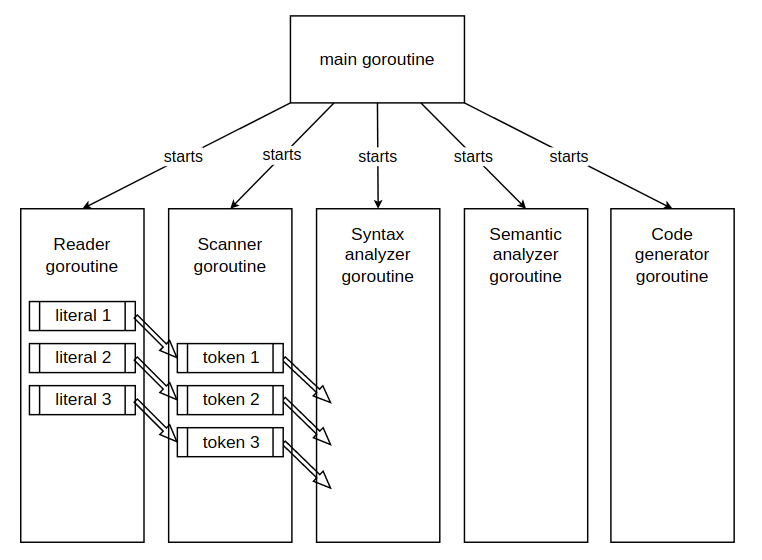

# Compiler

[](https://github.com/iskorotkov/compiler/actions/workflows/go.yml)

Простой компилятор, разработанный в рамках курса "Формальные грамматики и методы трансляции".

## Сборка

Для сборки данного компилятора требуется [Go версии 1.18 или новее](https://go.dev/dl/).

Для получения бинарного файла (рекомендуется) выполните:

```shell
go build -o build cmd/compiler/main.go
```

Для запуска компилятора без создания бинарного файла выполните:

```shell
go run cmd/compiler/main.go
```

## Использование

Существует два способа запустить компилятор:

```shell
# Режим чтения из файла:
./compiler program.pas
# и режим чтения из стандартного ввода-вывода:
./compiler
```

Примеры запуска:

```shell
# Несуществующий файл или файл, к которому нет доступа
./compiler program.pas
> open program.pas: no such file or directory

# Файл с корректной программой:
./compiler program.pas
> compiled successfully

# Файл с некорректной программой:
./compiler program.pas
> "module" at 1:1-7: expected "program", got "module": unexpected token

# Чтение из стандартного ввода-вывода (корректная программа):
cat program.pas | ./compiler
> compiled successfully
```

## Архитектура

### Взаимодействие модулей

Планируется организовать взаимодействие различных модулей компилятора посредством передачи сообщений через каналы Go между горутинами. Каждый модуль запускается в отдельной горутине и работает параллельно с другими модулями, при этом он получает от предыдущего модуля данные по каналу, переданному ему в качестве параметра, а результаты своей работы передает в другой канал, который может использоваться другим модулем компилятора. Таким образом, работа компилятора организована по принципу конвейера.



Каждый модуль работает в отдельной горутине, и работа компилятора завершается, когда заканчивают свою работу все горутины (типично это должен быть последний модуль компилятора, осуществляющий вывод ошибок или результатов компиляции в зависимости от ее успеха).

На данный момент предлагается такой набор модулей:

[Reader (модуль ввода)](#reader) =>
[Scanner (сканер, лексический анализатор)](#scanner) =>
[Syntax analyzer (синтаксический анализатор)](#syntax-analyzer) =>
[Type checker (семантический анализатор)](#type-checker) =>
[Code generator (генератор кода)](#code-generator).

### Передача общих зависимостей через контекст

При разработке компилятора возникла проблема: необходимо передавать одни и те же зависимости в разные модули компилятора, при этом описывать и передавать их в качестве отдельных параметров неудобно из-за их количества.

Было решено использовать типизированный контекст подобно тому, [как это сделала команда Khan Academy](https://blog.khanacademy.org/statically-typed-context-in-go/). При таком подходе контекст принимает следующий вид:

```go
package context

type FullContext interface {
	context.Context
	LoggerContext
	ErrorsContext
	NeutralizerContext
}

type LoggerContext interface {
	Logger() *zap.SugaredLogger
	setLogger(logger *zap.SugaredLogger)
}

type ErrorsContext interface {
	AddError(position literal.Position, err error)
	Errors() []Error
}

type NeutralizerContext interface {
	Neutralizer() syntax_neutralizer.Neutralizer
}
```

При этом есть две реализации интерфейса `FullContext` для двух окружений - dev и prod:

```go
package context

var _ FullContext = (*devContext)(nil)

type devContext struct {
	context.Context
	errorsContext
	neutralizerContext
	logger *zap.SugaredLogger
}

func NewDevContext(ctx context.Context) FullContext {
	// ...
}

// Аналогично для prod.
// ...
```

В различных модулях компилятора контекст используется следующим образом:

```go
package typecheck

func (c TypeChecker) Check(
	ctx interface {
	context.LoggerContext
	context.ErrorsContext
	context.NeutralizerContext
},
	input <-chan option.Option[ast.Node],
) <-chan option.Option[interface{}] {
	// ...
}
```

### Обработка ошибок

Любой из модулей может прервать работу конвейера при возникновении критической ошибки. В остальных случаях модуль передает ошибку дальше для обработки следующим модулем. Это возможно благодаря тому, что по каналам передаются не обязательно только результаты работы в случае успеха, а [дизъюнктивное объединение](https://ru.wikipedia.org/wiki/%D0%A2%D0%B8%D0%BF-%D1%81%D1%83%D0%BC%D0%BC%D0%B0) результата успеха и ошибки.

Тип `Option` описан следующим образом:

```go
package option

type Option[T any] struct {
	ok  T
	err error
}

func (o Option[T]) Unwrap() (T, error) {
	return o.ok, o.err
}

func (o Option[T]) String() string {
	if reflect.ValueOf(&o).Elem().FieldByName("err").IsNil() {
		return fmt.Sprintf("ok: %v", o.ok)
	}

	return fmt.Sprintf("err: %v", o.err)
}

func Ok[T any](val T) Option[T] {
	return Option[T]{ok: val}
}

func Err[T any](err error) Option[T] {
	return Option[T]{err: err}
}

```

### Нейтрализация ошибок

Нейтрализацию ошибок можно проводить на двух уровнях:

1. на синтаксическом уровне - ошибка в написании ключевого слова (исправляется заменой ошибочного написания на корректное)
2. на семантическом уровне - ошибка в написании идентификатора (также исправляется заменой ошибочного написания на корректное) или пропуск объявления символа (исправляется добавлением символа из контекста первого его использования)

Данные действия по нейтрализации ошибок позволяют вывести сообщения только об истинных причинах ошибки компиляции, не выводя информацию о последующих ошибках в тексте программы, вызванных ими. Например, ошибка в написании ключевого слова не должна приводить к ошибкам по всему тексту программы с места первого ошибочного написания, а ошибка в написании или пропуск объявления символа не выводит сообщения об ошибке на каждую встречу этого символа в тексте программы.

Нейтрализация ошибок также позволяет продолжить процесс компиляции с места возникновения ошибок, что позволяет обнаружить больше ошибок, расположенных дальше по тексту программы.

#### Нейтрализация ошибок в синтаксическом анализаторе

Текущая реализация синтаксического анализатора использует расстояние Левенштейна для нахождения способа исправления опечаток в написании ключевых слов языка. В качестве максимального расстояния для исправления используется значение 1, т. е. допускается одна опечатка в написании. Короткие слова (длиной 2 символа, такие как `if`) не исправляются, т. к. исправления в них неоднозначны из-за слишком малого количества букв, из-за чего теряется уверенность в том, было ли в действительности использовано это слово или же нет.

#### Нейтрализация ошибок в семантическом анализаторе

Нейтрализацию ошибок в написании в семантическом анализаторе можно проводить аналогично нейтрализации ошибок в синтаксическом анализаторе.

Нейтрализацию ошибок пропуска объявлений символов можно проводить, добавляя информацию о необъявленном символе в момент его первой встречи, а затем используя эту информацию при следующих встречах этого символа (как будто он уже был объявлен).

## Модули

### Reader

[Reader](internal/module/reader/reader.go) читает файл построчно и каждую строку разбивает на части - литералы ([Literal](internal/data/literal/literal.go)). При этом все знаки препинания и даже переход на новую строку также сохраняются как отдельные части для последующего анализа в следующих модулях.

Reader указывает для каждого литерала строку, начальный и конечный столбец (начиная индексирование с 1) для того, чтобы в последующих модулях можно было указать на возникшую ошибку на основе этих данных в литерале.

Reader использует регулярные выражения для нахождения [несловообразующих символов](https://docs.microsoft.com/ru-ru/dotnet/standard/base-types/character-classes-in-regular-expressions). Это позволяет разбить прочитанную строку по ним и передать по частям следующим модулям.

### Scanner

[Scanner](internal/module/scanner/scanner.go) читает литералы ([Literal](internal/data/literal/literal.go)) из канала, распознает их и записывает соответствующие им токены ([Token](internal/data/token/token.go)) в выходной канал с токенами. При получении ошибки из Reader она передается как есть далее. При невозможности распознать токен Scanner передает дальше ошибку и продолжает обработку следующих литералов.

Отрывок перечисления всех возможных токенов в тексте программы:

```go
package token

var (
	Unknown = ID(iota)

	// ...

	operatorsStart
	Eq
	Ne
	Lt
	Gt
	Lte
	Gte
	Plus
	Minus
	Multiply
	Divide
	ShiftLeft
	ShiftRight
	Assign
	operatorsEnd

	// ...
)
```

Распознавание числовых и булевых констант производится с помощью регулярных выражений. Строковые константы на данный момент не поддерживаются.

Распознавание пользовательских символов производится с помощью регулярного выражения.

В исходном коде компилятора перечислены все используемые в языке Паскаль токены, а также для них созданы отображения из строк в уникальные идентификаторы и обратно, что позволяет не хранить и сравнивать строковые значения литералов, а использовать уникальные идентификаторы для этого.

Использование уникальных идентификаторов также упрощает определение того, с токеном какого типа мы работаем (например, ключевое слово или оператор).

### Syntax analyzer

[Syntax analyzer](internal/module/syntax_analyzer/analyzer.go) читает токены из канала и использует описание синтаксиса языка для распознавания языковых конструкций и определения корректности поданной на вход программы.

#### БНФ

Синтаксис языка Паскаль описан в виде переменных, отражающих описание синтаксиса языка в формате БНФ из книги Л. Залоговой "Разработка Паскаль-компилятора". Все переменные удовлетворяют интерфейсу [BNF](internal/data/bnf/bnf.go) и имеют методы `String()` (для вывода в процессе отладки) и `Accept(log *zap.SugaredLogger, tokensCh *channel.TransactionChannel[option.Option[token.Token]]) error` для обработки поданных на вход токенов.

Для описания общих паттернов, используемых в БНФ, используются вспомогательные структуры:

- [`Either`](internal/data/bnf/either.go) - один из вариантов (аналог `x|y` в БНФ)
- [`Optional`](internal/data/bnf/optional.go) - необязательное вхождение конструкции (аналог `[x]` в БНФ)
- [`Sequence`](internal/data/bnf/sequence.go) - последовательность конструкций
- [`Several`](internal/data/bnf/several.go) - вхождение конструкций 0 или более раз (аналог `{x}` в БНФ)
- [`Token`](internal/data/bnf/token.go) - обертка для одного токена

Каждая из этих структур определяет алгоритм обхода при обработке токенов и обработку ошибок в случае появления не той конструкции, которая ожидалась.

Организация описания синтаксиса языка в виде переменных-объектах, образующих граф объектов, позволяет обрабатывать токены декларативно, т. к. для добавления новых синтаксических возможностей (или отключения поддержки старых) необходимо только добавить или удалить переменную, или ее использование при инициализации других переменных.

Отрывок описания синтаксиса языка из исходного кода компилятора:

```go
package bnf

func init() {
	// ...

	IntLiteral = Token{ID: token.IntLiteral}
	DoubleLiteral = Token{ID: token.DoubleLiteral}
	BoolLiteral = Token{ID: token.BoolLiteral}

	Sign = Optional{Name: "sign", BNF: Either{BNFs: []BNF{
		Token{ID: token.Plus},
		Token{ID: token.Minus},
	}}}

	Constant = Either{Name: "constant", BNFs: []BNF{
		Sequence{BNFs: []BNF{
			&Sign,
			Either{BNFs: []BNF{
				Either{BNFs: []BNF{
					&IntLiteral,
					&DoubleLiteral,
				}},
				Token{ID: token.UserDefined},
			}},
		}},
		&BoolLiteral,
	}, Markers: ast.Markers{ast.MarkerValue: true}}

	ConstantDefinition = Sequence{Name: "constant-definition", BNFs: []BNF{
		Token{ID: token.UserDefined, Markers: ast.Markers{ast.MarkerName: true}},
		Token{ID: token.Eq},
		&Constant,
	}, Markers: ast.Markers{ast.MarkerConstDecl: true}}

	// ...
}
```

#### Повторное чтение из канала

В данный момент все модули компилятора получают входные данные и возвращают результаты своей работы через каналы Go (Go channels), что накладывает некоторые ограничения при реализации этих модулей. Например, синтаксический анализатор при своей работе в некоторых случаях должен уметь откатываться назад и перечитывать некоторые токены повторно и в разных местах в коде, т. к. некоторые конструкции (например, [`Optional`](internal/data/bnf/optional.go) и [`Several`](internal/data/bnf/several.go)) читают токен, но не должны его поглощать при несовпадении токена с ожидаемым набором токенов. Каналы в Go не позволяют вернуть считанное значение обратно в начало канала.

Для обхода подобного ограничения в синтаксическом анализаторе решено использовать обертку вокруг каналов Go - структуру [`TxChannel[T any]`](internal/fn/channel/tx.go). Она предоставляет следующие методы:

- `Read` - чтение из канала
- `Open` - проверка открытости канала
- `StartTx` - начало новой транзакции (транзакции могут быть вложенными)
- `Commit` - подтверждение всех чтений последней транзакции (т. е. все чтения с момента начала предыдущей транзакции нельзя будет отменить)
- `Rollback` - откат всех чтений предыдущей транзакции (т. е. все прочитанные значения с момента начала предыдущей транзакции могут быть прочитаны заново в том же порядке)

Такая структура позволяет читать последовательности токенов неограниченное количество раз в исходном порядке.

#### Взаимодействие с семантическим анализатором

Синтаксический анализатор в процессе своей работы проверяет синтаксис программы, но он не учитывает семантику программы. Он не проверяет соответствие типов выполняемым с ними операциями и контексту использования выражений. Также он не проверяет, объявлены ли используемые пользовательские символы, а также нет ли повторного объявления каких-либо символов в той же области видимости.

Для выполнения всех этих действий необходим семантический анализ, но объединение синтаксического и семантического анализаторов может усложнить структуру и принцип работы компилятора, поэтому принято решение их разделить. Однако семантический анализатор должен получать доступ к данным о структуре программы, которая есть только у синтаксического анализатора. Необходимо каким-то образом передавать эти данные в семантический анализатор в удобном и понятном ему виде.

#### Генерация и использование AST

Для решения этой проблемы решено в процессе синтаксического анализа генерировать AST программы, в котором будет вся необходимая информация для проведения семантического анализа, применения оптимизаций (если такое потребуется) и генерации кода. Генерация AST происходит при анализе синтаксиса с помощью [графа объектов, отражающих БНФ описание синтаксиса языка](#БНФ).

Использование AST имеет следующие преимущества:

- простота генерации при анализе синтаксиса по БНФ (особенности реализации данного компилятора)
- полнота представления синтаксиса программы (AST содержит практически всю информацию о программе для использования ее другими модулями)

Но использование AST имеет также и недостатки:

- представление программы в виде AST слишком сильно привязано к реализации синтаксического анализа и потребует частого внесения изменений (особенности реализации данного компилятора)
- анализ AST фактически может потребовать от других модулей повторного анализа синтаксиса языка для их корректной работы (например, семантическому анализатору может понадобиться разбираться в объявлениях пользовательских символов по AST)

#### Использование аннотированного AST

Для упрощения работы других модулей со сгенерированным AST вместо простого AST используется аннотированное AST, в котором у каждого [узла дерева](internal/data/ast/node.go) есть набор меток ([маркеров](internal/data/ast/marker.go)), а также есть методы по поиску узлов дерева с определенной меткой. Такой подход жертвует производительностью работы (за счет более медленного поиска интересующих конкретный модуль узлов), но позволяет практически полностью абстрагироваться от жесткой структуры AST и даже синтаксиса анализируемого языка.

Таким образом, использование аннотированного AST сохраняет все преимущества работы с обычным AST, но значительно упрощает навигацию по нему для модулей, в которых работа с синтаксисом на низком уровне была бы излишней.

Узел AST имеет следующий интерфейс:

```go
package ast

type Node interface {
	Query(queryType QueryType, markers ...Marker) []Node
	Has(marker Marker) bool
	Position() literal.Position
	fmt.Stringer
}
```

У интерфейса `Node` есть две реализации: `Leaf` (лист дерева, содержит один токен и маркеры для узла) и `Branch` (ветвление дерева, содержит поддерево типа `Node` и маркеры для узла).

### Type checker

[Type checker](internal/module/typechecker/typechecker.go) проводит анализ объявлений типов, констант, переменных и функций, а также проверку соответствия типов в программе, используя информацию, полученную от синтаксического анализатора.

Он выполняет следующие функции:

- анализ объявления типов, констант, переменных, функций и параметров функций и организация этих объявлений в различные области видимости
- проверка соответствия типа литерала или ранее объявленного символа ожидаемому в выражении типу
- проверка возможности использования выражения определенного типа в текущем контексте (в условии цикла или условной конструкции)
- проверка возможности использования выражения в качестве фактического параметра для передачи ранее объявленной функции

Помимо этого, у компилятора есть компоненты [`TypeConverter`](internal/module/typechecker/typeconverter.go), который используется для проверки возможности приведения типов и [`TypeResolver`](internal/module/typechecker/typeresolver.go), который используется для определения типа выражения по типам операндов и операциям в нем. Они используются основным компонентом [`TypeChecker`](internal/module/typechecker/typechecker.go) для проверки корректности анализируемых программ.

#### Работа с AST

Для проверки выражений на корректность данный модуль использует возможности по поиску нужных участков в аннотированном AST. Модуль находит интересующие его поддеревья, после чего в ходе анализа производит поиск и анализ поддеревьев уже в рамках выбранного поддерева. Такое взаимодействие позволяет модулю абстрагироваться от особенностей генерации AST и строгого расположения узлов в дереве.

#### Анализ объявлений символов

Для проверки типов необходимо сохранять информацию о [пользовательских типах, типах констант и переменных, а также информацию о сигнатурах функций](internal/data/symbol/symbol.go). Эта информация используется далее для проверки возможности выполнения операций в выражениях, в которых участвуют пользовательские символы.

#### Анализ типа выражения

В присваиваниях и различных языковых конструкциях (`if`, `while`, `for`, `repeat`) необходимо анализировать тип выражения, чтобы определить, возможно ли использование данного выражения в этом контексте. Для определения типа, являющегося результатом выполнения вычисления, используются данные о токене (в случае литералов) и данные об объявленных пользователем символах.

#### Сбор и вывод ошибок

Все сообщения об отсутствии объявления символа или подвыражении или выражении, которое не может использоваться в определенном контексте, добавляются в список ошибок, выводятся в конце работы компилятора в удобном для человека виде. Каждая ошибка сопровождается комментарием о строке и колонке (колонках) в исходном тексте программы, в которых возникла ошибка. Вывод информации об источнике ошибки заметно облегчает диагностику и исправление ошибок в программах.

#### Вложенные области видимости

Для обработки вложенных областей видимости используется [специальная структура данных, имеющая ссылку на своего родителя - `Scope`](internal/data/symbol/scope.go). Это позволяет при работе с областью видимости сначала производить поиск в ней самой, а после - в родительской области видимости.

### Code generator

## Тестирование

### Unit-тесты

В процессе реализации модулей компилятора к ним также пишутся unit-тесты для проверки их корректной работы. Часть тестов для модуля Reader написаны классическим способом, но большая часть тестов используют снапшоты для сравнения результатов выполнения.

При первом выполнении теста сохраненного снапшота нет и поэтому тест всегда проходит и сохраняет снапшот результата вызова тестируемой функции в файл. При последующих запусках снапшот читается из файла и сравнивается с результатов вызова тестируемой функции, и если есть какие-либо различия, то тест отмечается проваленным. Данный подход позволяет избежать времязатратного описания ожидаемого результата в коде, т. к. сравниваются эталонное решение из снапшота и текущий результат. Вручную проверить эталонное решение, записанное в файле, намного проще, чем описывать его в коде и менять каждый раз при изменении особенностей реализации модулей.

### Ручное тестирование

В папке `testdata/programs` приведены примеры программ, демонстрирующих различные возможности компилятора. Работу компилятора можно тестировать на них, или написать свою программу и запустить компилятор на ней.

С включенным [режимом отладки](#Отладка) также можно отлаживать работу компилятора на различных программах.

## Отладка

Компилятор в ходе работы выводит в лог информацию для отладки, если при запуске компилятора переменная окружения `DEBUG` имеет значение `1`. Это позволяет значительно проще и быстрее обнаружить, локализовать и устранить ошибку в реализации компилятора. Кроме того, компилятор не засоряет логами вывод, если переменная `DEBUG` не установлена или установлена в другое значение, что улучшает UX.

## CI/CD

При каждом пуше в ветку `main` GitHub собирает и тестирует компилятор. Для каждого PR GitHub также собирает и тестирует компилятор, что позволяет обнаружить ошибки в реализации до слияния ветки.
